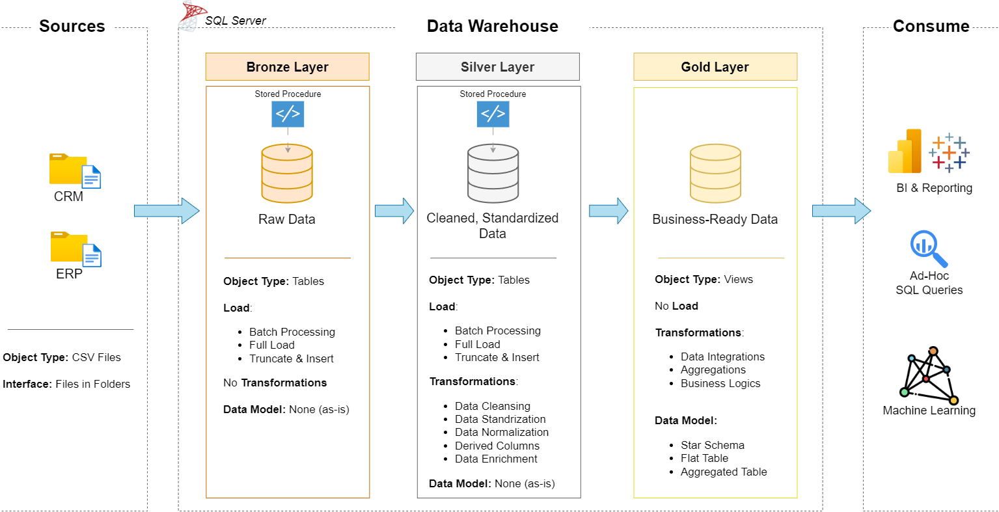

# Data Warehouse and Analytics 

**This project demonstrates a comprehensive data warehousing and analytics solution, from building a data warehouse to generating actionable insights. Designed as a portfolio project, it highlights industry best practices in data engineering and analytics.**

---
## Data Architecture

The data architecture for this project follows Medallion Architecture **Bronze**, **Silver**, and **Gold** layers:


1. **Bronze Layer**: Stores raw data as-is from the source systems. Data is ingested from CSV Files into SQL Server Database.
2. **Silver Layer**: This layer includes data cleansing, standardization, and normalization processes to prepare data for analysis.
3. **Gold Layer**: Houses business-ready data modeled into a star schema required for reporting and analytics.

---
## Project Overview

This project involves:

1. **Data Architecture**: Designing a Modern Data Warehouse Using Medallion Architecture **Bronze**, **Silver**, and **Gold** layers.
2. **ETL Pipelines**: Extracting, transforming, and loading data from source systems into the warehouse.
3. **Data Modeling**: Developing fact and dimension tables optimized for analytical queries.
4. **Analytics & Reporting**: Creating SQL-based reports and dashboards for actionable insights.

This repository is an excellent resource for professionals and students looking to showcase expertise in:
- SQL Development
- Data Architect
- Data Engineering  
- ETL Pipeline Developer  
- Data Modeling  
- Data Analytics  

---

## Important Links & Tools:

Everything is for Free!
- **[Datasets](datasets/):** Access to the project dataset (csv files).
- **[SQL Server Express](https://www.microsoft.com/en-us/sql-server/sql-server-downloads):** Lightweight server for hosting your SQL database.
- **[SQL Server Management Studio (SSMS)](https://learn.microsoft.com/en-us/sql/ssms/download-sql-server-management-studio-ssms?view=sql-server-ver16):** GUI for managing and interacting with databases.

---

---

## Running the Project on macOS (Docker + VS Code)

SQL Server does not run natively on macOS.  
To support macOS users, this project runs **SQL Server inside Docker** using **Azure SQL Edge**, and connects to it using **Visual Studio Code**.

This setup mirrors real-world development environments and allows the full ETL pipeline to run locally.

---

### Prerequisites (macOS)

Install the following tools:

- **Docker Desktop for Mac**  
  https://www.docker.com/products/docker-desktop/
- **Visual Studio Code**  
  https://code.visualstudio.com/
- **SQL Server Extension for VS Code** (`ms-mssql.mssql`)
- **Git**

---

### Step 1: Clone the Repository

```bash
git clone https://github.com/<your-username>/sql-data-warehouse.git
cd sql-data-warehouse
```

### Step 2: Pull SQL Server Image (Azure SQL Edge)
```bash
docker pull mcr.microsoft.com/azure-sql-edge:latest
```

### Step 3: Run SQL Server in Docker
Run the container and mount the datasets/ directory so SQL Server can access the CSV files.
```bash
docker run -d --name sqledge \
  -e "ACCEPT_EULA=Y" \
  -e "MSSQL_SA_PASSWORD=YourStrongPassword123!" \
  -p 1433:1433 \
  -v $(pwd)/datasets:/datasets \
  mcr.microsoft.com/azure-sql-edge:latest
```

### Step 4: Verify Dataset Mount
```bash
docker exec -it sqledge bash -lc "ls -lah /datasets"
```
You should see
```bash
source_crm/
source_erp/
```

### Step 5: Connect to SQL Server Using VS Code

- Open VS Code

- Install the SQL Server (mssql) extension

- Open Command Palette (Cmd + Shift + P)

- Select MS SQL: Connect

- Use the following connection details:

## Project Requirements

### Building the Data Warehouse (Data Engineering)

#### Objective
Develop a modern data warehouse using SQL Server to consolidate sales data, enabling analytical reporting and informed decision-making.

#### Specifications
- **Data Sources**: Import data from two source systems (ERP and CRM) provided as CSV files.
- **Data Quality**: Cleanse and resolve data quality issues prior to analysis.
- **Integration**: Combine both sources into a single, user-friendly data model designed for analytical queries.
- **Scope**: Focus on the latest dataset only; historization of data is not required.
- **Documentation**: Provide clear documentation of the data model to support both business stakeholders and analytics teams.

---

### BI: Analytics & Reporting (Data Analysis)

#### Objective
Develop SQL-based analytics to deliver detailed insights into:
- **Customer Behavior**
- **Product Performance**
- **Sales Trends**

These insights empower stakeholders with key business metrics, enabling strategic decision-making.  

## Repository Structure
```
sql-data-warehouse/
│
├── datasets/                           # Raw datasets used for the project (ERP and CRM data)
│
├── docs/                               # Project documentation and architecture details
│   ├── etl.png                         # file shows all different techniquies and methods of ETL
│   ├── data_architecture.png           # file shows the project's architecture
│   ├── data_catalog.md                 # Catalog of datasets, including field descriptions and metadata
│   ├── data_flow.png                   # file for the data flow diagram
│   ├── data_model.png                  # file for data models (star schema)
│   ├── naming_conventions.md           # Consistent naming guidelines for tables, columns, and files
│
├── scripts/                            # SQL scripts for ETL and transformations
    ├── init_database.sql               # Script to create database and schemas
    ├── exec.sql                        # Script to run the procedures for bronze and silver layer
│   ├── bronze/                         # Scripts for extracting and loading raw data
│   ├── silver/                         # Scripts for cleaning and transforming data
│   ├── gold/                           # Scripts for creating analytical models  
│
├── tests/                              # Test scripts and quality files
│
├── README.md                           # Project overview and instructions
```
---
